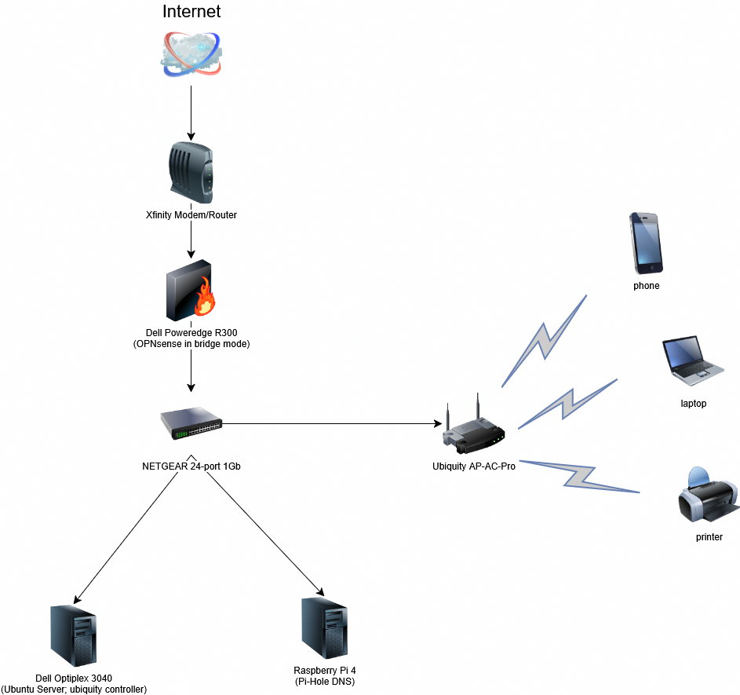

# Journal 01 -- Initial Planning

+ **Date:** 2025-08-21
+ **Phase:** Planning

---

## Summary
Today I created the initial roadmap for my homelab. The purpose is to design a structured, multi-phase plan that takes me from the very first setup (networking, firewall, DNS) to more advanced capabilities (backups, monitoring). This roadmap will serve as a guiding document for all future journals.

---

## Roadmap Overview

### Phase 0 (Planning and Design)
- Define goals
- Document current hardware
- Create multi-phase plan
- Result: Roadmap and documentation strategy

### Phase 1 (Network Core)
- Deploy OPNsense to R300 & install between switch and router/modem
- Physically setup network
- Result: A foundation for the rest of the network

### Phase 2 (DNS & Ad-Blocking)
- Deploy Pi-Hole to Raspberry Pi 4
- Set OPNsense to forward DNS to Pi-Hole
- Result: Network-wide ad-blocking and tracking

### Phase 3 (WiFi)
- Install and configure Unify controller software on the Optiplex 3040
- Adopt Unify AP and create an SSID
- Result: Extended wireless connectivity with centralized management

### Phase 4 (Review & Maintenince)
- Audit configurations, phyically reorganize rack/wiring
- Document final network topology
- Create plan for network upgrade (Proxmox as hypervisor lab-wide for easy backups, setting up a backup server, deploy better monitoring stack)
- Result: Stability check before network upgrade and actual plan for upgrade

# Network Topology

